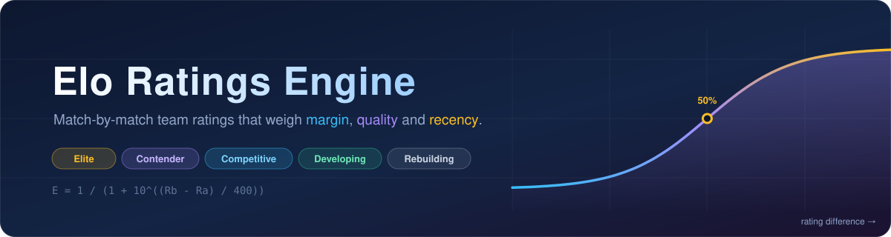

<div align="center">



<p>
  
  
  
  
  
  
</p>

<p>
  <b>A weighted Elo rating system for team sports.</b><br>
  It updates ratings match by match, rewarding teams for <i>how</i> they won &mdash; the margin,<br>
  the strength of the opponent, and how recently it happened &mdash; not just <i>that</i> they won.
</p>

</div>

---

## Contents

- [Why this exists](#why-this-exists)
- [Demo](#demo)
- [Key features](#key-features)
- [Installation](#installation)
- [Usage](#usage)
- [How the math works](#how-the-math-works)
- [Configuration](#configuration)
- [Project structure](#project-structure)
- [Testing](#testing)
- [Known limitations](#known-limitations)
- [Roadmap](#roadmap)
- [Contributing](#contributing)
- [License](#license)

---

## Why this exists

Classic Elo only asks one question: **did you win?** A 3–0 sweep of the national champion counts exactly the same as a 3–2 escape against the worst team in the conference.

That's fine for chess. It's a poor fit for volleyball, where a scoreline carries real information.

This engine keeps the Elo core intact and scales the update by three multipliers:

| Question Elo ignores | What this engine does |
| :--- | :--- |
| *How decisively did you win?* | **Margin** — a sweep moves ratings more than a five-setter |
| *Who did you beat?* | **Quality** — upsets are rewarded, blowouts of weak teams are discounted |
| *When did it happen?* | **Recency** — a match from October counts more than one from last February |

It also solves the cold-start problem: instead of starting every team at 1500 and waiting half a season for the ratings to mean anything, you can **seed** initial ratings from preseason statistics.

---

## Demo

Two evenly matched teams. Nebraska wins 3–1.

```python
from datetime import datetime
from elo_ratings_engine import RatingSystem, tier_from_rating

season = RatingSystem()
season.ratings["Nebraska"]  = 1820
season.ratings["Wisconsin"] = 1795

season.apply_update("Nebraska", "Wisconsin", 3, 1, datetime.now())

for team, rating in season.ratings.items():
    print(f"{team:<12} {rating:7.1f}  {tier_from_rating(rating)}")
```

```console
Nebraska      1838.0  Elite
Wisconsin     1777.0  Contender
```

Now the part plain Elo gets wrong — **the same win is worth different amounts depending on who earned it:**

```console
underdog (1500) beats favorite (1700) 3-1  ->  1538.0   (+38.0)
favorite (1700) beats underdog (1500) 3-1  ->  1707.2   ( +7.2)
```

Same scoreline, same K-factor. The upset is worth **5x** more, because beating someone better than you is stronger evidence than beating someone worse.

---

## Key features

- 🏐 **Margin-aware** — a 3–0 sweep carries a 1.5x multiplier, a 3–2 grind carries 1.1x
- 🎯 **Upset-aware** — the update scales with the rating gap, clamped to ±50% so one fluke can't distort a season
- ⏳ **Time-decayed** — older results fade exponentially, so ratings track current form
- 🌱 **Statistical seeding** — turn a preseason stat sheet into starting ratings via a 17-factor weighted composite
- 🏆 **Human-readable tiers** — every rating maps to a label (`Elite`, `Contender`, `Competitive`, `Developing`, `Rebuilding`)
- 🔒 **Bounded** — ratings are clamped to a fixed floor and ceiling, so nothing runs away
- 🎛 **Sport-agnostic** — every constant and weight lives in one config file; the math has no volleyball hardcoded into it
- ✅ **Tested** — 23 tests, including checks against published Elo reference values

---

## Installation

Requires **Python 3.11+**.

```bash
git clone https://github.com/ryanbjorkdeveloping/elo-calculator.git
cd elo-calculator

python -m venv .venv
source .venv/bin/activate        # Windows: .venv\Scripts\activate

pip install -e ".[dev]"
```

Verify it worked:

```bash
pytest -q
```

```console
.......................                    [100%]
23 passed in 0.13s
```

---

## Usage

### 1. Rate matches as they happen

`RatingSystem` holds a `{team: rating}` dictionary. Any team it hasn't seen before enters at `START_RATING` (1500).

```python
from datetime import datetime
from elo_ratings_engine import RatingSystem

season = RatingSystem()                 # or RatingSystem(k_factor=24)

season.apply_update(
    team_a="Nebraska",
    team_b="Wisconsin",
    score_a=3,                          # sets won
    score_b=1,
    match_date=datetime(2026, 9, 12),
)

print(season.ratings)
```

> [!NOTE]
> `score_a` and `score_b` are **sets won**, not points. The margin multiplier is derived from the set ratio.

### 2. Ask for a win probability

`expected_score()` is the Elo forecast — the probability that A beats B.

```python
season.expected_score(1700, 1500)   # 0.75975  -> a 76% favorite
season.expected_score(1500, 1500)   # 0.5      -> a coin flip
```

### 3. Label a rating

```python
from elo_ratings_engine import tier_from_rating

tier_from_rating(1838)   # 'Elite'
tier_from_rating(1412)   # 'Developing'
```

### 4. Seed ratings from preseason stats

Rather than starting a season blind, convert a stat sheet into ratings. Give it a `DataFrame` indexed by team, with any of the columns named in `FACTOR_WEIGHTS`:

```python
from elo_ratings_engine import weighted_composite, composite_to_minmax

composite = weighted_composite(stats_df)        # weighted 0–1 score per team
ratings   = composite_to_minmax(composite)      # rescaled into 1000–2200

season = RatingSystem()
season.ratings = ratings.to_dict()              # start the season here
```

Running that on the five-team sample in [`tests/test_seeding.py`](tests/test_seeding.py):

```console
Team        Composite    Rating    Tier
Aces           1.0700    2200.0    Elite
Diggers        0.8063    1895.8    Elite
Blockers       0.5915    1647.9    Competitive
Cyclones       0.2652    1271.4    Rebuilding
Eagles         0.0300    1000.0    Rebuilding
```

Columns missing from your `DataFrame` are simply skipped, so you can seed from whatever data you actually have.

---

## How the math works

### The Elo core

Each team's expected score comes from the standard logistic curve — the one drawn in the banner above:

```math
E_A = \frac{1}{1 + 10^{(R_B - R_A)/400}}
```

A 400-point edge means a ~91% expected win rate. After the match, the rating moves by the gap between what happened and what was expected:

```math
R'_A = R_A + K_{adj} \times (S_A - E_A)
```

where `S_A` is 1 for a win and 0 for a loss.

### The three multipliers

The whole contribution of this engine is in `K_adj`. Instead of a fixed K of 32, it's scaled:

```math
K_{adj} = K \times M_{margin} \times M_{quality} \times M_{recency}
```

<table>
<tr><th align="left">Multiplier</th><th align="left">Formula</th><th align="left">Behaviour</th></tr>
<tr>
<td><b>Margin</b><br><sub>how decisive</sub></td>
<td><code>0.5 + (sets_won / total_sets)</code></td>
<td>
3–0 sweep → <b>1.50</b><br>
3–1 win &nbsp;&nbsp;→ <b>1.25</b><br>
3–2 win &nbsp;&nbsp;→ <b>1.10</b>
</td>
</tr>
<tr>
<td><b>Quality</b><br><sub>who you beat</sub></td>
<td><code>1 + clamp((R_loser − R_winner) / 800, ±0.5)</code></td>
<td>
+200 upset → <b>1.25</b><br>
even match → <b>1.00</b><br>
−200 expected → <b>0.75</b>
</td>
</tr>
<tr>
<td><b>Recency</b><br><sub>how long ago</sub></td>
<td><code>exp(−days_ago / 30)</code></td>
<td>
today → <b>1.00</b><br>
30 days → <b>0.37</b><br>
60 days → <b>0.14</b>
</td>
</tr>
</table>

### Worked example

Nebraska (1820) beats Wisconsin (1795) 3–1, today:

```text
E_nebraska  = 1 / (1 + 10^((1795 − 1820)/400))       = 0.53596
margin      = 0.5 + (3 / 4)                          = 1.25000
quality     = 1 + (1795 − 1820)/800                  = 0.96875
recency     = exp(−0 / 30)                           = 1.00000
                                                       ─────────
K_adj       = 32 × 1.25 × 0.96875 × 1.0              = 38.75000

Nebraska    = 1820 + 38.75 × (1 − 0.53596)           = 1838.0
Wisconsin   = 1795 + 38.75 × (0 − 0.46404)           = 1777.0
```

Both ratings are then clamped into `[MIN, MAX]` = `[1000, 2200]`.

### The seeding pipeline

```text
  raw stats          min-max normalise        apply weights          rescale
  DataFrame    -->   each column to 0-1   -->   & invert the     -->   to 1000-2200
                                                rank columns
```

Rank-style columns (`AVCA_Rank`, `RPI_Rank`) are flagged `False` in `FACTOR_WEIGHTS` and inverted, because for those **lower is better**. Columns where every team is tied normalise to `0.5` rather than dividing by zero.

---

## Configuration

Everything tunable lives in [`src/elo_ratings_engine/config.py`](src/elo_ratings_engine/config.py). Adapting this to another sport means editing that one file.

<details>
<summary><b>How volatile should ratings be?</b></summary>

`K_FACTOR = 32` is the base step size. Raise it for a faster-moving, more reactive rating; lower it for a stabler one. You can also override it per instance with `RatingSystem(k_factor=24)`.
</details>

<details>
<summary><b>How fast should old results fade?</b></summary>

`DECAY_HALF_LIFE = 30` is the decay constant in days for `exp(−days / 30)`. Larger values make history linger; smaller values make ratings hug recent form. (See [Known limitations](#known-limitations) — despite the name, this is not a true half-life.)
</details>

<details>
<summary><b>What's the rating scale?</b></summary>

`MIN = 1000`, `MAX = 2200`, `START_RATING = 1500`. `MIN` and `MAX` are hard clamps applied after every update, and they're also the target range for seeded ratings.
</details>

<details>
<summary><b>How are tiers assigned?</b></summary>

`TIER_THRESHOLDS` is a descending list of `(floor, label)` pairs, matched top-down:

| Rating | Tier |
| ---: | :--- |
| 1800+ | 🥇 Elite |
| 1650+ | 🥈 Contender |
| 1500+ | 🥉 Competitive |
| 1350+ | 📈 Developing |
| below | 🔧 Rebuilding |
</details>

<details>
<summary><b>How is the seeding composite weighted?</b></summary>

`FACTOR_WEIGHTS` maps each stat to `(weight, higher_is_better)`. The **15 core factors sum to exactly 1.00**; the two win-rate factors are additive extras (`+0.10`) that only apply once a rankings CSV supplies them, bringing the total to 1.10:

| Group | Weight | Rationale |
| :--- | ---: | :--- |
| Hitting efficiency | 0.32 | Most predictive of winning |
| Kills | 0.21 | Offensive output |
| Blocks | 0.14 | Net dominance |
| Official rankings | 0.16 | AVCA poll + RPI strength-of-schedule |
| Assists | 0.10 | System execution |
| Win rates | 0.10 | Overall + conference record *(extra)* |
| Digs | 0.07 | Back-row defense |

Because `composite_to_minmax()` rescales by min–max at the end, the weights don't have to sum to any particular number — only their **ratios** affect the final ordering. Add, remove, or reweight freely; `weighted_composite()` only uses the columns your `DataFrame` actually contains.
</details>

---

## Project structure

```text
elo-calculator/
├── src/elo_ratings_engine/
│   ├── __init__.py      # public API re-exports
│   ├── config.py        # all constants, weights and thresholds
│   ├── core.py          # RatingSystem: expected_score(), apply_update()
│   ├── kfactor.py       # the three multipliers + total_weight()
│   ├── seeding.py       # stat sheet  ->  starting ratings
│   └── tiers.py         # rating      ->  human-readable label
├── tests/               # 23 pytest tests
├── assets/              # README banner
└── pyproject.toml
```

**Public API** — what `from elo_ratings_engine import ...` gives you:

| Name | Purpose |
| :--- | :--- |
| `RatingSystem` | The rating engine: `.ratings`, `.expected_score()`, `.apply_update()` |
| `tier_from_rating` | Rating → tier label |
| `minmax_normalize` | Scale a `Series` to 0–1 |
| `weighted_composite` | Stats `DataFrame` → weighted composite score |
| `composite_to_minmax` | Composite score → rating on the `MIN`–`MAX` scale |

The multipliers are importable directly from `elo_ratings_engine.kfactor` if you want to inspect them.

---

## Testing

```bash
pytest -q             # run everything
pytest -v             # per-test names
pytest tests/test_kfactor.py
```

The suite deliberately pins down the parts that are easy to get quietly wrong:

- `expected_score()` is checked against **published Elo reference values** (+400 → 0.90909, +200 → 0.75975) and for symmetry (`E_A + E_B == 1`)
- `apply_update()` is re-derived by hand from the multiplier helpers and compared
- The `MIN` / `MAX` clamps are tested with inputs that provably overflow them
- A regression test guards the upset bug described below

---

## Known limitations

Honest notes on the current state — these are real and worth knowing before you trust the output.

1. **`DECAY_HALF_LIFE` is not a half-life.** It's the decay constant in `exp(−days / 30)`, so after 30 days the weight is `1/e ≈ 0.37`, not `0.5`. The true half-life is ~20.8 days. The name is misleading; the behaviour is intentional.

2. **Recency is measured against `datetime.now()`.** `apply_update()` compares each match to the moment you run it, so a rating built by replaying a full season will heavily discount early matches, and re-running it later gives different numbers. For reproducible historical ratings, pass dates relative to a fixed reference point.

3. **Future-dated matches inflate the update.** A `match_date` after today produces a recency weight greater than 1. There's no guard against it.

4. **`margin_multiplier()` ignores its `margin` argument.** Only the set ratio is used. Point margins within sets don't currently affect anything.

5. **Order matters, and there's no replay.** Ratings are mutated in place with no match history, so results must be fed in chronologically and there's no way to recompute or audit past states.

6. **`K_FACTOR_MIN` / `K_FACTOR_MAX` are unused.** The adjusted K is not currently clamped, so an extreme sweep-upset can reach `32 × 1.5 × 1.5 = 72`.

---

## Roadmap

- [ ] `predict_match()` — a public forecasting method wrapping `expected_score()`
- [ ] `compute_k()` — clamp the adjusted K into `[K_FACTOR_MIN, K_FACTOR_MAX]`
- [ ] Match history + rating replay, so a season can be recomputed deterministically
- [ ] Explicit "as of" date instead of `datetime.now()`
- [ ] Season-level driver that ingests a schedule `DataFrame` end to end
- [ ] Backtesting: measure predicted vs. actual outcomes to tune the weights empirically

---

## Contributing

Issues and pull requests are welcome.

1. Fork and branch off `main`
2. `pip install -e ".[dev]"`
3. Add tests for the behaviour you're changing — the multiplier functions are pure and easy to test
4. Make sure `pytest -q` is green
5. Open a PR describing *what* changed and *why*

If you're changing the rating math, please include the before/after numbers for a concrete match. It makes the effect of a change far easier to review than the diff alone.

---

## License

This project is released under the [MIT License](LICENSE). You're free to use, modify, and distribute it, commercially or otherwise, as long as the copyright notice is kept.

---

<div align="center">
<sub>Built with Python 🐍 and pandas 🐼 &nbsp;·&nbsp; README structure adapted from <a href="https://www.youtube.com/watch?v=a8CwpGARAsQ">The Git Guild</a></sub>
</div>
